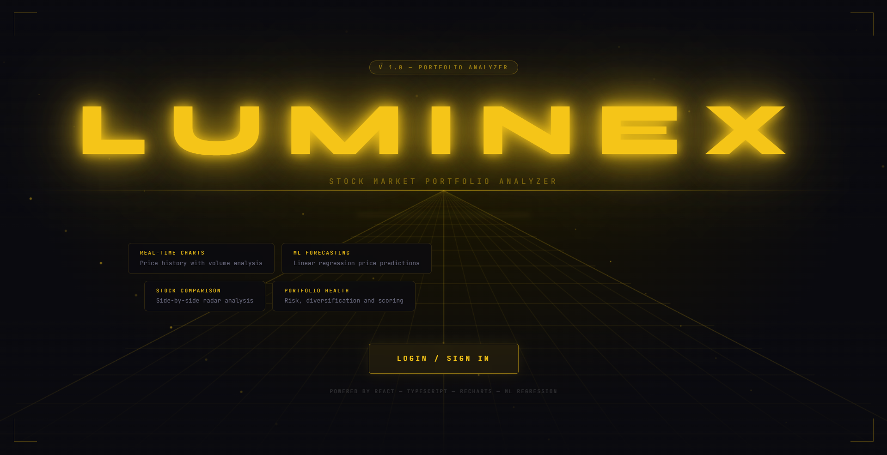
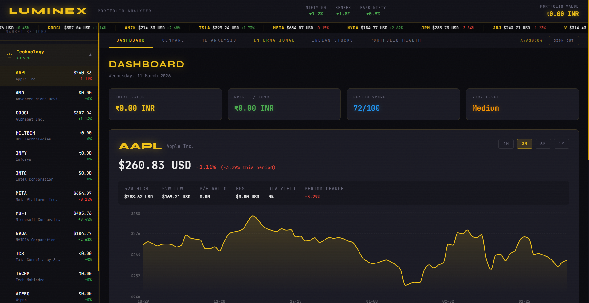
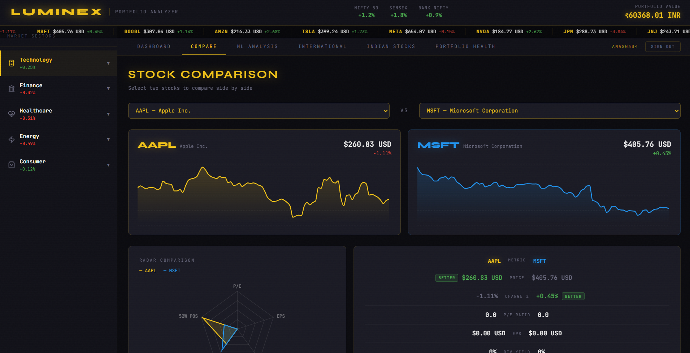
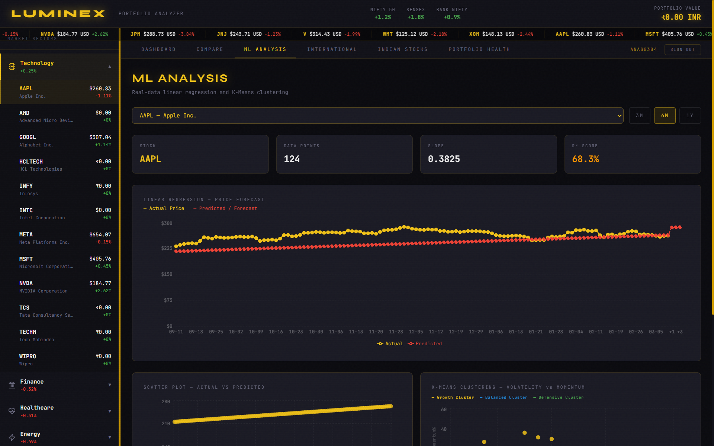
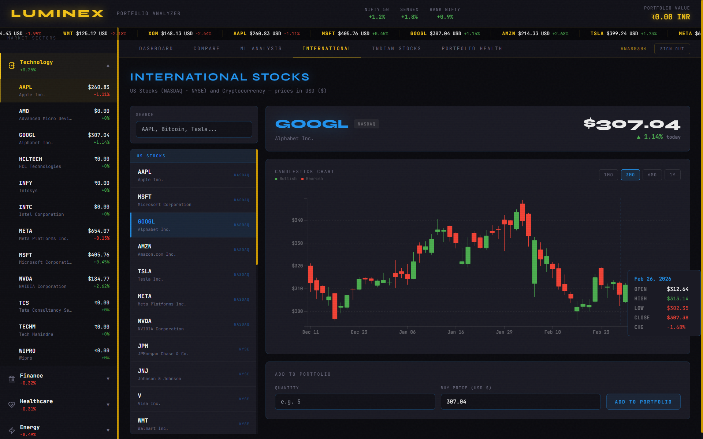
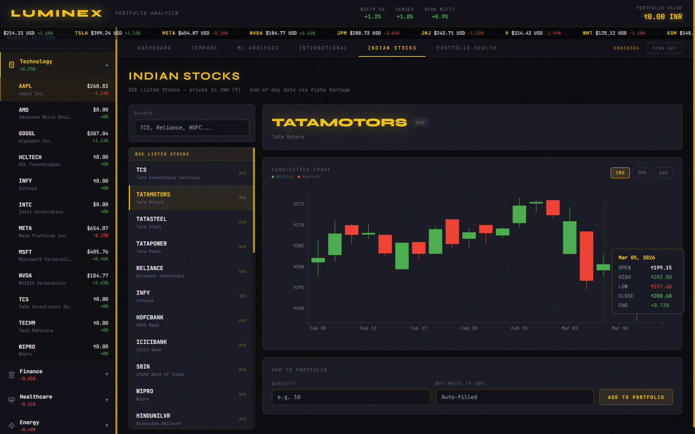
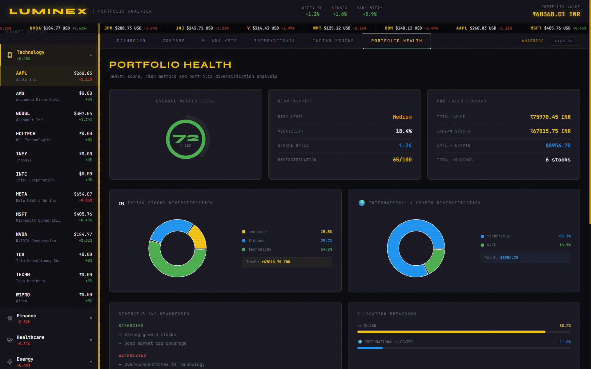
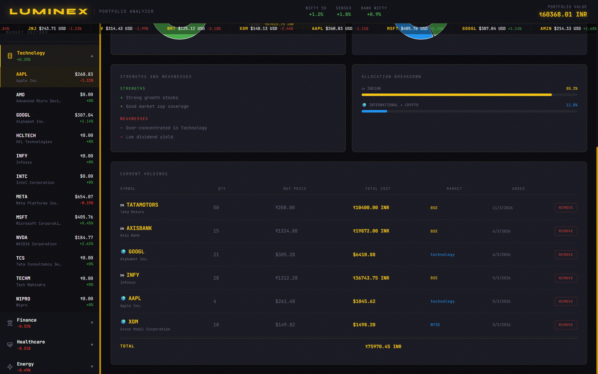

# 🚀 Luminex – AI Stock Market Portfolio Analyzer

<p align="center">
  
</p>

<p align="center">
  <strong>An AI-powered stock portfolio analysis platform with real-time charts, ML predictions, and portfolio health insights.</strong>
</p>

---

# 🌟 Overview

**Luminex** is a modern **AI-powered stock market portfolio analyzer** that helps investors understand their portfolio performance, compare stocks, and forecast prices using **Machine Learning**.

The application integrates:

- 📈 Real-time stock data
- 🤖 Machine Learning predictions
- 📊 Portfolio analytics
- 🌍 International & Indian stock markets
- 📉 Risk and diversification analysis

Built with a **full-stack architecture** using **FastAPI + React + TypeScript + Machine Learning**.

---

# 🖼️ Application Preview

## 🏠 Landing Page


---

## 🔐 Authentication

Secure user authentication system with registration, login, and password recovery.


---

## 📊 Dashboard

The dashboard provides an overview of:

- Total portfolio value
- Profit/Loss
- Health score
- Risk level
- Interactive stock charts



---

## 🔍 Stock Comparison

Compare two stocks side-by-side using interactive charts and radar metrics.



Features:

- Performance comparison
- Financial metric radar charts
- Price trend analysis

---

## 🤖 Machine Learning Analysis

Luminex includes a **Linear Regression prediction engine** for stock price forecasting.



Displays:

- Actual vs predicted price
- R² accuracy score
- Data points used
- Trend slope

---

## 🌍 International Stocks

Track global companies and cryptocurrencies.



Features:

- Candlestick charts
- Real-time price tracking
- Portfolio integration

---

## 🇮🇳 Indian Stock Market

Track Indian companies listed on the **BSE**.



Features:

- Historical price charts
- Easy portfolio integration
- Sector classification

---

## 💼 Portfolio Health Analysis

Advanced portfolio analytics including:

- Diversification score
- Risk level
- Volatility
- Sharpe ratio



---

## 📋 Portfolio Holdings

View and manage all your holdings in one place.



Features:

- Total portfolio value
- Individual stock breakdown
- Remove holdings
- Allocation analysis

---

# 🧠 Machine Learning Features

Luminex includes ML models to analyze stock data:

### Linear Regression
Predicts future stock prices based on historical trends.

### K-Means Clustering
Groups stocks by:

- Volatility
- Momentum
- Growth potential

---

# 🏗️ Tech Stack

### Frontend

- React
- TypeScript
- Vite
- Recharts
- React Financial Charts

### Backend

- FastAPI
- Python
- SQLAlchemy
- JWT Authentication
- SQLite

### Machine Learning

- Scikit-Learn
- Pandas
- NumPy

### Data Sources

- Yahoo Finance API
- Alpha Vantage API

---

# 📂 Project Structure

```
Luminex
│
├── backend
│   ├── app
│   │   ├── core
│   │   ├── models
│   │   ├── routes
│   │   └── main.py
│   │
│   └── scripts
│
├── stock-analyzer
│   ├── src
│   │   ├── pages
│   │   ├── components
│   │   ├── store
│   │   └── api.ts
│
└── README.md
```

---

# ⚙️ Installation

## 1️⃣ Clone the repository

```bash
git clone https://github.com/YOUR_USERNAME/Luminex-Stock-Market-Portfolio-Analyzer.git
```

```
cd Luminex-Stock-Market-Portfolio-Analyzer
```

---

# 🖥 Backend Setup

Create virtual environment:

```
python -m venv venv
```

Activate:

Windows

```
venv\Scripts\activate
```

Install dependencies:

```
pip install -r requirements.txt
```

Run backend server:

```
cd backend
uvicorn app.main:app --reload
```

Backend runs on:

```
http://127.0.0.1:8000
```

API docs:

```
http://127.0.0.1:8000/docs
```

---

# 🌐 Frontend Setup

Open another terminal:

```
cd stock-analyzer
```

Install dependencies:

```
npm install --legacy-peer-deps
```

Run development server:

```
npm run dev
```

Frontend runs on:

```
http://localhost:5173
```

---


## Run with PM2

Install dependencies

Backend

pip install -r requirements.txt

Frontend

npm install

Start server

pm2 start ecosystem.config.js

Monitor

pm2 status
pm2 logs
pm2 monit

# 🔐 Environment Variables

Create a `.env` file in the backend:

```
JWT_SECRET=your_secret_key
JWT_ALGORITHM=HS256
JWT_EXPIRE_MINUTES=60
```

---

# 🚀 Features

✔ AI-powered stock prediction  
✔ Portfolio diversification analysis  
✔ Real-time stock charts  
✔ International & Indian markets  
✔ Risk scoring system  
✔ Machine learning insights  
✔ Interactive stock comparison  
✔ Portfolio tracking dashboard  

---

# 📊 Future Improvements

- Real-time streaming stock prices
- Deep learning price prediction
- TradingView chart integration
- Portfolio optimization AI
- Cloud deployment (Azure / AWS)

---

# 👨‍💻 Author

**Anas Jahagirdar**

GitHub  
https://github.com/anasjahagirdar

---

# ⭐ Support

If you like this project, consider giving it a ⭐ on GitHub!
